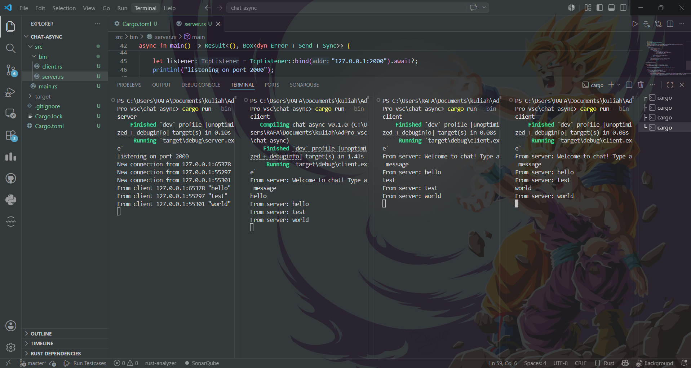
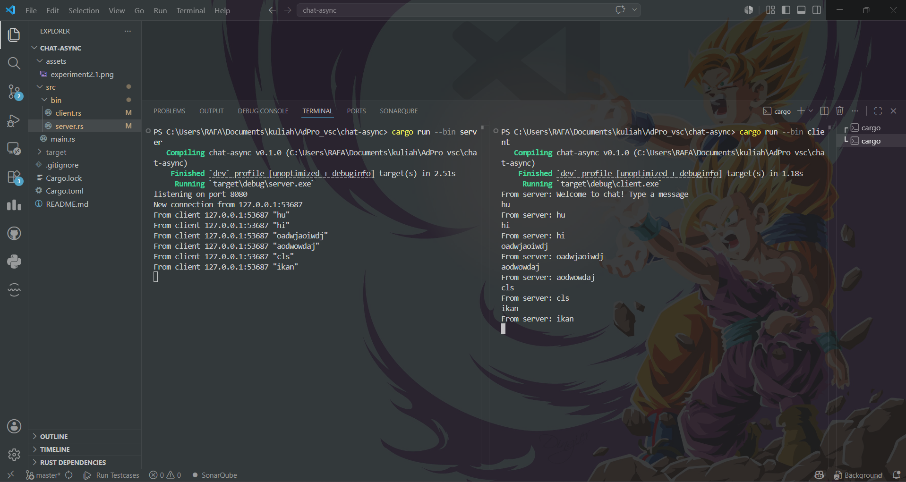
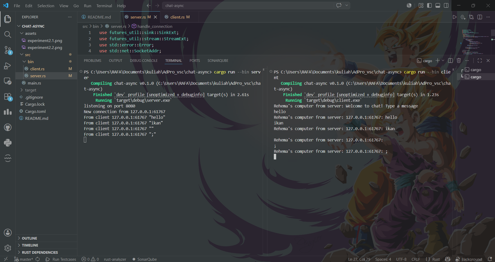

## Experiment 2.1

Cara Menjalankan:

Buka satu terminal, lalu jalankan server dengan perintah: cargo run --bin server. Server akan berjalan dan mendengarkan pada port 2000.

Buka terminal baru (bisa di-split atau di tab baru), dan jalankan client pertama dengan perintah: cargo run --bin client.

Buka lagi dua terminal baru, dan jalankan client kedua dan ketiga menggunakan perintah yang sama.

Apa yang Terjadi Ketika Mengetik Pesan?
Ketika klien pertama mengetik sesuatu dan menekan Enter, input tersebut ditangkap oleh fungsi stdin.next_line() dan dikirim ke server melalui protokol WebSocket (ws_stream.send(...)).

Server menggunakan makro tokio::select! untuk menangani banyak event secara asinkron. Ketika server menerima pesan, ia mengirimkannya ke bcast_tx (Tokio Broadcast Channel). Channel ini lalu "menyiarkan" (broadcast) pesan tersebut ke semua fungsi receiver (bcast_rx) yang dimiliki klien lain, sehingga pesan tersebut muncul di layar terminal milik klien kedua dan ketiga di waktu yang hampir bersamaan.

## Experiment 2.2

Penjelasan Modifikasi Port:
Pada eksperimen ini, port koneksi diubah dari 2000 menjadi 8080. Karena komunikasi ini bersifat client-server, perubahan port wajib dilakukan di kedua sisi:  

Di sisi Server: TcpListener::bind("127.0.0.1:8080") agar server mendengarkan permintaan masuk pada port 8080.

Di sisi Client: Uri::from_static("ws://127.0.0.1:8080") agar klien mencoba menyambung ke port yang tepat.

Program ini tetap menggunakan protokol WebSocket yang sama.

Pada sisi Client, protokol ini didefinisikan secara eksplisit pada awalan (scheme) URI koneksinya, yaitu awalan ws:// pada string "ws://127.0.0.1:8080".

Pada sisi Server, protokol ini tidak didefinisikan melalui string URL, melainkan diterapkan dengan cara menerima koneksi Transmission Control Protocol (TCP) biasa, lalu melakukan upgrade koneksi tersebut menjadi jalur WebSocket menggunakan fungsi ServerBuilder::new().accept(socket) dari library tokio-websockets.

## Experiment 2.3

Pada eksperimen ini, saya menambahkan informasi IP dan Port pengirim pada setiap pesan chat. Modifikasi ini dilakukan di sisi server (server.rs).  Ketika server menerima pesan dari klien (msg.as_text()), server sudah memiliki informasi IP dan Port klien tersebut melalui variabel addr: SocketAddr. Saya membuat variabel baru formatted_msg menggunakan makro format!("{}: {}", addr, text).  Alasan modifikasi diletakkan di server adalah agar server menjadi pusat kendali bentuk data (single source of truth). Dengan memodifikasi pesannya sebelum masuk ke fungsi bcast_tx.send(), secara otomatis semua klien yang melakukan subscribe ke channel tersebut akan menerima pesan yang sudah berisi identitas pengirim tanpa perlu mengubah logika ekstraksi (parsing) data di sisi klien.

## Bonus
Untuk membuat server Rust (chat-async/server.rs) bekerja menggantikan server JavaScript (SimpleWebsocketServer), saya harus mengubah server Rust dari "penerus raw string" menjadi server berbasis JSON yang memiliki state.

Saya menambahkan struct bawaan serde (WebSocketMessage, MsgTypes, MessageData) pada server Rust agar identik dengan struktur di frontend Yew.

Saya menambahkan fitur Shared State menggunakan Arc<Mutex<HashMap<SocketAddr, String>>> untuk melacak username dari setiap koneksi yang aktif (berdasarkan IP/Port).

Saat klien mengirimkan message_type: "register", server Rust akan menyimpan nama mereka ke HashMap, lalu mem-broadcast pesan Users yang berisi seluruh nama agar sidebar daftar teman di frontend Yew diperbarui secara real-time.

Saat klien mengirimkan obrolan atau payload dari game Arena, server Rust membongkar pesan tersebut, membungkusnya ke dalam struct MessageData (memasukkan nama pengirim dan isi pesannya), mengubahnya kembali menjadi string JSON, lalu menyebarkannya.

Perubahan ini berhasil karena server Rust sekarang mampu mereplikasi logika internal Node.js tanpa harus memodifikasi satu baris kode pun di bagian klien YewChat. Frontend tidak menyadari bahwa backend-nya telah diganti dari JavaScript ke Rust. Sistem keluar-masuk pemain (disconnect) juga diurus secara aman karena memori hashmap dibersihkan saat fungsi ws_stream.next() tidak menerima input lagi.

Opini Saya (JavaScript vs Rust):
Meskipun implementasi JavaScript (Node.js) lebih singkat dan cepat ditulis karena sifat datanya yang dynamically typed (bisa menerima bentuk JSON apa saja secara otomatis), saya lebih memilih versi Rust. Menggunakan Rust pada arsitektur Full-Stack (Yew di frontend dan Tokio di backend) memberikan keamanan tipe data (strict typing). Saya bisa meletakkan struct WebSocketMessage yang sama persis di kedua sisi. Jika ada payload yang tidak sesuai format, program akan menolak mem-parse JSON-nya sejak fase compile atau runtime deserialization, sehingga mencegah terjadinya malfungsi logika pada saat dijalankan. Selain itu, kecepatan konkuren dari Tokio melampaui kemampuan single-threaded event-loop milik Node.js.